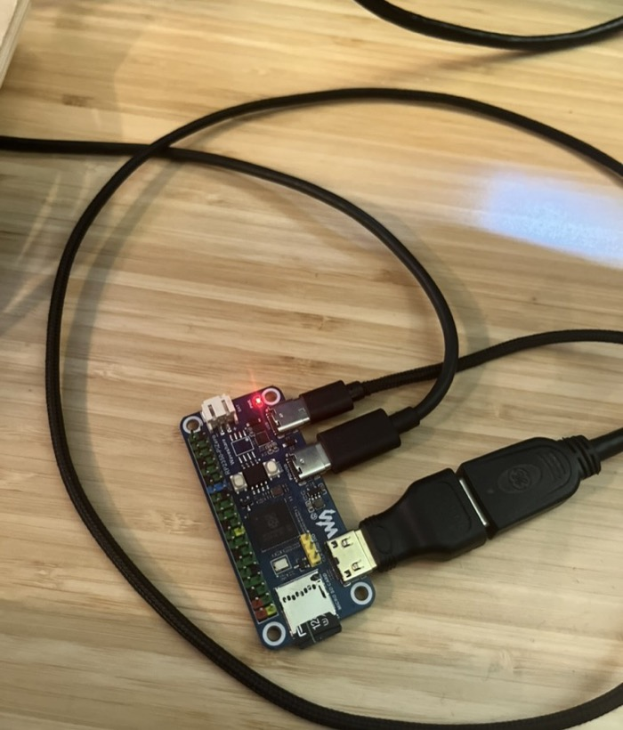
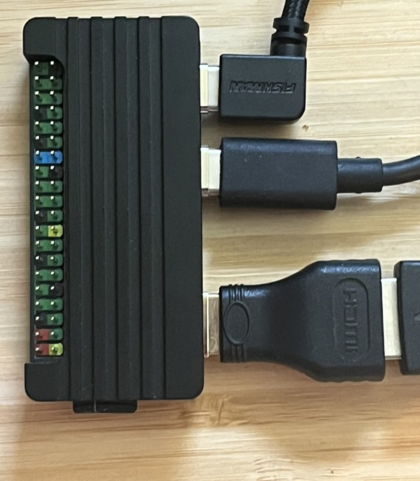

# XRoar on the Waveshare RP2350-PiZero

A port of the **XRoar** Tandy Color Computer (CoCo) emulator to the
[Waveshare RP2350-PiZero](https://www.waveshare.com/rp2350-pizero.htm), driving a
**mini-HDMI display** with **USB-host keyboard/joystick** input.

This started as an evaluation port — could the RP2350-PiZero run XRoar at least as well as an earlier
RP2350-Touch-AMOLED-1.8 port (which boots Color BASIC to "OK" at ~36% real-time)? It does,
comfortably: it boots Color BASIC over HDMI at a **locked 60 fps** (standard **640×480p60**), full
real-time, with a real **USB keyboard typing directly into BASIC** and **CoCo audio played over the
same HDMI cable**. Only joystick input remains open.

<p align="center">
  
</p>

## Goal

- Output to HDMI at 2× the CoCo's native resolution, at 30 fps or better.
- USB host for a real keyboard and joystick.
- CoCo emulation on core 0; video, keyboard, and SD-card access on core 1.

## What you need

- **Waveshare RP2350-PiZero** board ([product page](https://www.waveshare.com/rp2350-pizero.htm)).
- **A mini-HDMI display connection** — a mini-HDMI→HDMI cable, or a mini-HDMI→HDMI
  adapter plus a standard HDMI cable, into any HDMI monitor/TV. (The board's HDMI
  port is the *mini* size.) The signal is standard 640×480p60 (4:3).
- **A USB keyboard** plus whatever adapter reaches the board's **USB-host** port
  (the PIO-USB Type-C; the *other* Type-C is power/programming). Note: the host is
  **USB 1.1 only** — simple wired keyboards and full-speed wireless USB receivers
  work; high-speed USB 2.0 peripherals do not enumerate (see Status).
- **A microSD card** (FAT32) holding the CoCo ROMs you supply (see below) — required.
- **USB-C power** to the power/programming port.
- For building/flashing: a host PC with **[PlatformIO](https://platformio.org/install)**
  (Core CLI or the VS Code extension).

<p align="center">
  
  <br>
  <em>The connections: two USB-C (USB-host keyboard + power) and the mini-HDMI→HDMI adapter.</em>
</p>

> **ROMs are not included.** Color/Extended/Disk BASIC are © Microsoft/Tandy and
> are not redistributable. You must supply your own dumps (from hardware you own).
> Only `bas12.rom` is strictly required; see [`AUTORUN.md`](AUTORUN.md) for the
> full SD-card layout.

## Quick start

1. **Build & flash** the firmware (default env is the 60 fps + audio + USB build):
   ```bash
   pio run -t upload          # build + flash; see docs/BUILD.md for envs/flags
   ```
   If the upload can't reset the board, hold **BOOT** while plugging in USB-C.
2. **Prepare a microSD** (FAT32): create `/coco/` and copy your ROMs in as
   `/coco/bas12.rom` (and optionally `extbas11.rom`, `disk11.rom`). Add an
   optional `/coco/autorun.txt` to auto-load disks/programs — see [`AUTORUN.md`](AUTORUN.md).
3. **Connect & power on**: mini-HDMI → monitor, USB keyboard → host port, insert
   the microSD, then apply USB-C power. The CoCo boots to the BASIC `OK` prompt;
   type directly on the keyboard. `pio device monitor` (115200) shows `[run]`
   telemetry over serial.

Full build details, the env/flag matrix, and toolchain notes are in
[`docs/BUILD.md`](docs/BUILD.md).

## Target hardware

The RP2350-PiZero is a Raspberry Pi Zero form-factor board built around the **RP2350B**:

- **MCU**: RP2350B (dual Cortex-M33 / dual Hazard3 RISC-V), 48 GPIO, 150 MHz stock (overclockable).
- **Memory**: 520 KB on-chip SRAM, 16 MB flash. A PSRAM pad exists on the PCB but is **not populated** — treat this as an SRAM-only target.
- **Display**: mini-HDMI connector carrying a DVI signal, driven from GPIO via PIO (see below).
- **Input**: a dedicated PIO-USB Type-C port usable as a USB 1.1 host (a second Type-C is power/programming).
- **Storage**: microSD slot on SPI.

### Pinout (confirmed against the Waveshare schematic and demo source)

| Function | GPIO | Notes |
|---|---|---|
| HDMI TMDS data 2 (±) | 32 / 33 | DVI driven by PIO `libdvi` |
| HDMI TMDS data 1 (±) | 34 / 35 | |
| HDMI TMDS data 0 (±) | 36 / 37 | |
| HDMI TMDS clock (±) | 38 / 39 | |
| HDMI DDC / CEC | 44 + others | not needed for video output |
| microSD SCK | 30 | SPI, ~12.5 MHz |
| microSD MOSI | 31 | |
| microSD MISO | 40 | |
| microSD CS | 43 | software chip-select |
| microSD card-detect | 22 | |
| USB host D+ / D− | 28 / 29 | PIO-USB; D− is always D+ +1 |
| I²C0 SDA / SCL | 6 / 7 | |
| UART0 TX / RX | 0 / 1 | |
| WS2812 status LED | 2 | |

The reference DVI configuration is the upstream `pico_sock_cfg` (`invert_diffpairs = false`,
`pio_set_gpio_base(pio, 16)` because the TMDS pins are above GPIO 31).

## How the HDMI output works

The mini-HDMI connector is wired **directly to RP2350 GPIOs** through series resistors — there is no
HDMI transmitter chip. DVI carries video as four TMDS differential pairs (clock + 3 data lanes = 8
wires), and each pair is produced by two adjacent GPIOs driven in opposite polarity.

The RP2350 has two ways to generate that high-speed TMDS bitstream:

- **PIO `libdvi`** (Wren6991/PicoDVI) — PIO state machines + DMA do the TMDS encoding in software.
- **HSTX** — a dedicated hardware serialiser, but it is hardwired to **GPIO 12–19 only**.

On this board the HDMI connector is on **GPIO 32–39**, so **HSTX cannot drive it** — `libdvi` (PIO) is
the only option. This matches Waveshare's own reference demos, which use `libdvi` on this board.

For the full end-to-end signal path — emulated CoCo screen and sound all the way to the HDMI pins,
including how audio rides inside the TMDS stream as data islands — see
[`docs/pipeline.md`](docs/pipeline.md).

### Display geometry

A literal 640×480 RGB565 framebuffer would be ~614 KB and does not fit in 520 KB SRAM alongside the
64 KB of CoCo RAM and ROM images. Instead the framebuffer is **320×240 RGB565 (~154 KB)** and `libdvi`
scans it out **pixel- and line-doubled to 640×480p 60 Hz** in hardware (`DVI_VERTICAL_REPEAT = 2`).

The CoCo's native 256×192 is centred inside the 320×240 buffer (32 px left/right, 24 px top/bottom
border). After the 2× hardware scale-out it appears on the monitor as **512×384 with blank borders** —
which is the "2× resolution" target. The blitter writes 320×240 in landscape with no rotation.

## System-clock reconciliation (HDMI + USB host) — resolved

DVI and PIO-USB want different system clocks: DVI's TMDS bit clock prefers ~252 MHz for
640×480p60 (25.175 MHz pixel), while Pico-PIO-USB asserts the CPU is *exactly* 120 MHz or
240 MHz. The original bring-up (`PIZERO-02b`) sidestepped this by running at **240 MHz** with an
off-spec 24 MHz pixel clock (~52–57 Hz refresh). **`PIZERO-44`/`PIZERO-45` resolved it properly:
at 252 MHz the PIO-USB clock dividers come out *exact* (252/48 = 5.25), so USB and a standard
25.2 MHz pixel clock coexist.** The default build now runs **252 MHz → 25.2 MHz pixel, 800×525 =
true 60.0 Hz** — standard, monitor-friendly 640×480p60 with correct game speed and USB host all at
once. The emulator is paced from `FRAME_PERIOD_US` (16.67 ms) to match. (The old 240 MHz/~52 Hz
timing is kept only as a fallback env — see [`docs/BUILD.md`](docs/BUILD.md).)

## Software architecture

```
┌──────────────────────────────────────────────────────────┐
│  core 0  CoCo emulation (6809 + SAM + PIA + VDG)          │
│  core 1  blit → DVI scanout (libdvi), SD + USB servicing  │
├──────────────────────────────────────────────────────────┤
│  lib/coco_machine   CoCo bus glue + minimal FDC  (reused) │
│  lib/xroar_core     vendored XRoar core          (reused) │
├──────────────────────────────────────────────────────────┤
│  libdvi             PIO DVI driver (Wren6991/PicoDVI)     │
│  Pico-PIO-USB + Adafruit TinyUSB   USB host              │
│  no-OS-FatFS-SD     microSD over SPI                     │
└──────────────────────────────────────────────────────────┘
```

The XRoar core (`lib/xroar_core`) and the CoCo glue (`lib/coco_machine`) are board-agnostic and are
reused unchanged from the AMOLED port; only the RAM allocation (no PSRAM here) and the display blitter
need adapting. Everything below the line — DVI, USB, SD — is board-specific and built on Waveshare's
proven reference stack for this board (earlephilhower arduino-pico core).

## Roadmap

Work is tracked in `issues.jsonl` (use `/issues` to list). Phases:

| Phase | Goal | Issues | Status |
|---|---|---|---|
| 0 | Decisions + scaffolding | PIZERO-01..03 | ✅ done |
| 1 | HDMI bring-up: DVI test pattern | PIZERO-04..05 | ✅ done |
| 2 | XRoar boots to Color BASIC "OK" on HDMI | PIZERO-06..09 | ✅ done |
| 3 | Autonomous self-running demo | PIZERO-10 | ✅ done |
| 4 | USB-host keyboard / joystick input | PIZERO-11/11a/11b/12/13 | 🟡 keyboard done; joystick + hot-replug open |
| 5 | Dual-core split + performance | PIZERO-14..15 | ✅ done |
| 6 | HDMI audio over the existing cable (CoCo 6-bit DAC + 1-bit sound) | PIZERO-18, 26–35, 38/39 | ✅ done — streaming per-active-line delivery (warble fixed) |
| 7 | Clean audio + stability | PIZERO-33 (watchdog), PIZERO-35/38 (delivery re-arch) | ✅ done |
| 8 | True in-spec 640×480p60 + audio + USB at 252 MHz | PIZERO-44/45 | ✅ done — now the default build |

USB host enumeration + keyboard input verified on hardware; remaining open work in Phase 4 is
`PIZERO-13` (joystick) and `PIZERO-11b` (hot-replug bug — USB devices only enumerate on a cold
boot; unplugging and re-plugging doesn't re-attach).

**Phase 6/7 — HDMI audio (working).** XRoar's 6-bit DAC + single-bit sound are encoded as HDMI
**data-island audio-sample packets** by an extended `libdvi` and played over the existing cable.
CoCo `SOUND`/`PLAY`/game audio is recognizable and **pitch-matched to desktop XRoar**. The original
bursty per-line scheme warbled; `PIZERO-38` re-architected delivery to **stream one metered audio
island onto every active line** (encoded a line ahead in the core-1 DMA IRQ, per Shuichi Takano's
reference — our packet encoder is ported from his `pico_lib`), which fixed the warble. `PIZERO-33`
added a core-1 watchdog that auto-recovers a wedged board. A small residual fidelity gap vs desktop
XRoar remains and is **source-side** (the resampler, tracked in `PIZERO-41`), not delivery.

**Phase 8 — true 60 Hz (`PIZERO-44`/`PIZERO-45`).** Running at 252 MHz makes the PIO-USB dividers
exact, so standard **640×480p60** video, a correct 60 Hz game speed, USB host, and streaming audio
all coexist. This is now the **default build**. The off-spec 240 MHz/~52 Hz timing is retained only
as a fallback env. Remaining audio polish: `PIZERO-41` (source-side fidelity) and `PIZERO-32`
(ACR CTS value is sink-dependent — a multi-monitor robustness item). The synth/sound-chip
experiment (`PIZERO-17`) remains a stretch.

## Build

PlatformIO with the earlephilhower arduino-pico core, targeting the RP2350B.
**See [`docs/BUILD.md`](docs/BUILD.md)** for the full env + build-flag matrix and
toolchain gotchas — in short:

```
pio run                 -t upload   # DEFAULT: true 640x480p60 + HDMI audio + USB
pio run -e pizero       -t upload   # fallback: silent, double-buffered, tear-free
pio device monitor                  # serial @ 115200 — prints per-second [run] fps/cpu/blit
```

A bare `pio run` builds the default `pizero_stream_60` env (60 Hz, streaming HDMI
audio, USB host). The silent `pizero` baseline and the off-spec 52 Hz envs are kept
as fallbacks. Don't enable flags via the `PLATFORMIO_BUILD_FLAGS` env var — it links
stale objects (see BUILD.md §4b).

A microSD card is required, with the CoCo ROMs at **`/coco/bas12.rom`** (and optionally
`/coco/extbas11.rom`), plus an optional `disk11.rom` cart, a `.dsk` image, and `autorun.txt`
(see [`AUTORUN.md`](AUTORUN.md)).

## Status

**Phases 0–8 complete except for two open Phase-4 input items.** The default build boots Color
BASIC over HDMI at **standard 640×480p60**, a locked 60 fps with correct game speed, a **USB
keyboard typing directly into BASIC** (`PIZERO-11`/`12`), and **CoCo audio over the HDMI cable**.
The autonomous `autorun.txt` loader (`PIZERO-10`, see [`AUTORUN.md`](AUTORUN.md)) works. The silent
fallback env is double-buffered and fully tear-free (`PIZERO-14`); the default audio build is
single-buffered (RAM is spent on audio-island buffers), so it can show mild tearing.

**HDMI audio works** (`PIZERO-30`/`38`): CoCo `SOUND`/`PLAY`/game sound plays over the HDMI cable
via `libdvi` data-island packets, **pitch-matched to desktop XRoar**. The early bursty delivery
warbled; `PIZERO-38` switched to streaming one metered island per active line, which fixed it. A
small residual fidelity gap vs desktop remains and is **source-side** (the resampler, `PIZERO-41`).
Also fixed along the way: **`PIZERO-31`** — the CoCo's 60 Hz field-sync timer IRQ was never enabled
in this port, so `PLAY`, the cursor blink, and `SOUND n,d` hung forever; now they work.

Remaining open work: **`PIZERO-13`** (USB joystick) and the **undiagnosed** **`PIZERO-11b`** (USB
devices enumerate only on a cold boot with the device already attached; hot-replug doesn't
re-enumerate — no confirmed root cause). Audio polish: **`PIZERO-41`** (source-side fidelity) and
**`PIZERO-32`** (ACR CTS value is sink-dependent — a multi-monitor robustness item).

USB device-compatibility caveat: Pico-PIO-USB is USB 1.1 only, so modern high-speed USB 2.0
peripherals (e.g. Keychron K2, standalone gaming mice) don't enumerate. Simple wired USB
keyboards and full-speed wireless USB receivers are the working class.

Note: 640×480 is 4:3, so 16:9 monitors stretch it unless set to 4:3/aspect scaling.

## Performance

The headline result: **Color BASIC runs at a locked 60 fps** — full real-time — on a 252 MHz system
clock driving standard 640×480p60, with ~30% of the core-0 frame budget still free even with
USB-host servicing running on core 0. (The silent fallback build is also fully tear-free via double
buffering; the default audio build single-buffers to free RAM for audio.)

Per-frame work on core 0, against the 60 Hz frame period of **16.67 ms**:

| Work | Time | Notes |
|---|---|---|
| CoCo emulation | ~9.4 ms | ~14,900 6809 cycles/frame at the emulated ~0.895 MHz |
| `render_frame` (alpha/text) | ~0.56 ms | precomputed glyph-row → packed-word LUT |
| Blit to framebuffer | ~1.5 ms | 320×240 RGB565, landscape, no rotation |
| **Total** | **~11.5 ms** | ~5.3 ms (31%) headroom per frame |

How we got from the first boot (54 fps) to a locked 60 fps:

- **Paint the static border once** at init instead of re-clearing it every frame — saves ~27K
  redundant pixel writes per frame (`src/coco_boot.cpp`).
- **Glyph-row → packed-32-bit-word render LUT** for alpha (text) mode, replacing per-pixel
  read-modify-write: **~6.4 ms → ~0.56 ms** per frame. (Graphics modes still use the per-pixel path.)
- **Double buffering** (`PIZERO-14`): two 320×240 RGB565 buffers with a `volatile` front-buffer
  handoff from core 0 to core 1, so `libdvi` never samples a half-rendered frame. Costs ~89% RAM.

Performance instrumentation, clock, and vreg tuning landed in `PIZERO-15`; the serial monitor prints
per-second `[run]` fps/cpu/blit stats. For comparison, the AMOLED port manages ~15 fps (~36%
real-time), so this is roughly a **4× improvement**.

That ~31% headroom also sets the ceiling on guest-initiated **CoCo high-speed POKEs** (SAM
double-speed): the emulation is paced by fixed emulated *time* per frame, so audio pitch and video
stay correct, but a sustained full `POKE 65497` roughly doubles core-0 emulation cost and overruns
the frame budget. See [`docs/cpu-speed.md`](docs/cpu-speed.md).

Note the two distinct clocks: the host RP2350 MCU runs at **252 MHz** (set from the DVI TMDS bit
clock), while the *emulated* 6809 runs at its authentic **~0.895 MHz** — independent of the host clock.

## References

- Waveshare RP2350-PiZero wiki — https://www.waveshare.com/wiki/RP2350-PiZero (board schematic mirrored at `docs/RP2350-PiZero-schematic.pdf`)
- USB-host reference: [ugufru/waveshare-rp2350-usb-a](https://github.com/ugufru/waveshare-rp2350-usb-a)
- Upstream DVI driver: [Wren6991/PicoDVI](https://github.com/Wren6991/PicoDVI)
- USB host stack: [sekigon-gonnoc/Pico-PIO-USB](https://github.com/sekigon-gonnoc/Pico-PIO-USB) + Adafruit TinyUSB
