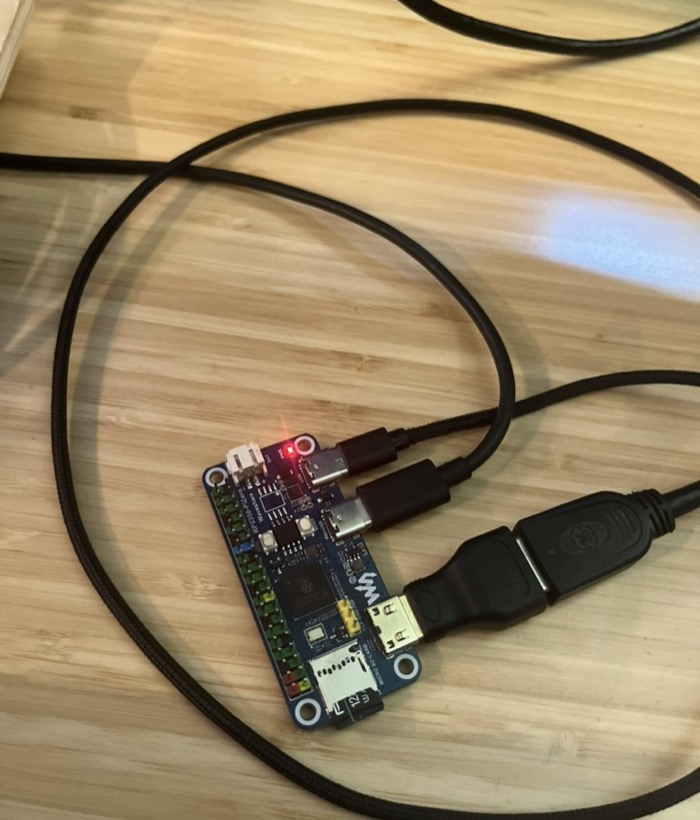
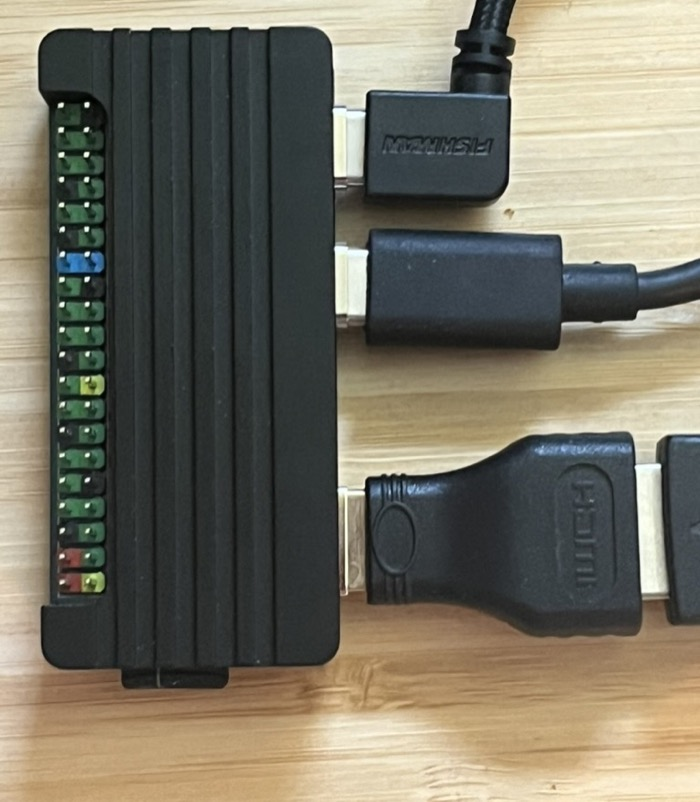

# CoCo Zero

**A Tandy Color Computer 2 on a board the size of a stick of gum.** Plug in a TV, a USB-C keyboard
or gamepad, and a microSD card, and it starts Color BASIC. The picture and the sound both go
over one video cable, at 60 frames per second.

It is [XRoar](https://www.6809.org.uk/xroar/), the CoCo emulator, running on a
[Waveshare RP2350-PiZero](https://www.waveshare.com/rp2350-pizero.htm), a microcontroller board the
size of a Raspberry Pi Zero.

<p align="center">
  
</p>

## What it does

- It runs a Tandy Color Computer 2 (CoCo 2) at full speed: Color BASIC, Extended BASIC, Disk BASIC,
  games and demos.
- It shows the picture on any modern TV or computer monitor, at 640×480 and 60 frames per second.
- It plays the sound through the same video cable.
- It also has the three-voice sound chip from the Games Master Cartridge (the SN76489), so games
  written for that cartridge play their music.
- It lets you choose disks, programs and cartridges from lists on the screen. You highlight one and
  press ENTER to start it.
- It works with a USB-C keyboard. Each key types the character printed on it.
- It works with a USB-C gamepad. The gamepad acts as the CoCo's two joysticks, and you can choose
  and start games with the gamepad alone.
- It reads its settings from text files on the card. You can change them on a computer, or on the
  CoCo Zero itself. A setting can apply to every game, or to just one game.
- It has a choice of text fonts, including one with true lower case.
- It saves a picture of the screen to the card when you press Print Screen.
- It can start a game of your choice automatically when you switch it on.
- It fits a 3D-printed case shaped like a CoCo 2. The design files are included.

## What you need

- A **Waveshare RP2350-PiZero** board ([product page](https://www.waveshare.com/rp2350-pizero.htm)).
  It has two USB-C ports and one mini video port (the same small video connector as a Raspberry Pi Zero). One USB-C port is for power, and for installing the
  firmware. The other USB-C port is for your keyboard and gamepad.
- A **TV or computer monitor** with a digital video input, and a **mini video cable or adapter** to
  reach it (the kind sold for the Raspberry Pi Zero).
- A **USB-C power supply**, such as a phone charger.
- A **USB-C keyboard**, a **USB-C gamepad**, or both.
  - A keyboard or gamepad with the older, rectangular USB-A plug works too, with a small USB-C to
    USB-A adapter.
  - To use a keyboard and a gamepad at the same time, plug them into a simple **USB-C hub**. Some
    larger hubs, with several hub chips inside, do not work yet.
  - The keyboard and gamepad port runs at USB 1.1 speed (full speed). Ordinary keyboards, wireless
    receivers and most gamepads work. A device that only works at high speed does not.
- A **microSD card**, formatted FAT32, with the CoCo ROM files on it. You supply the ROMs (see
  below). Only `bas12.rom` is required.
- A computer with [PlatformIO](https://platformio.org/install) and a **USB-C cable**, to install the
  firmware.
- *Optional:* the printable [case](hardware/case/README.md).

> **ROMs are not included.** Color, Extended and Disk BASIC are © Microsoft and Tandy and may not be
> redistributed. Use dumps from hardware you own.

<p align="center">
  
  <br>
  <em>The two USB-C ports (keyboard and gamepad, and power) and the mini video adapter.</em>
</p>

## Quick start

1. **Install the firmware.** Connect the board's USB-C power port to your computer and run
   `pio run -t upload`. If the upload can't reset the board, hold the **BOOT** button while you
   plug in the USB-C cable.
2. **Fill the microSD card.**
   - Put the ROMs in the folder `/coco/roms/`: `bas12.rom`, and if you have them, `extbas11.rom` and
     `disk11.rom`.
   - Put disks (`.dsk` files) in `/coco/dsk`, programs (`.bin` files) in `/coco/bin`, and cartridges
     (`.ccc` files) in `/coco/cart`.
3. **Connect everything and switch on.**
   - Plug the TV or monitor into the mini video port.
   - Plug the keyboard or gamepad (or the hub) into the USB-C keyboard port.
   - Push the microSD card into its slot.
   - Last, plug USB-C power into the power port.

   The `OK` prompt appears after a few seconds. If the card or a ROM is missing, the screen tells you
   what to copy, and where.
4. **Play a game.** Press **F12** for disks, **F9** for programs, or **F10** for cartridges. On a
   gamepad, press **Home**. Highlight a game, then press **ENTER** (or **A** on the gamepad).

To start a game automatically at power-on, see [`AUTORUN.md`](AUTORUN.md). Every setting is
explained in [`SETTINGS.md`](SETTINGS.md).

## Controls

| To | Keyboard | Gamepad |
|---|---|---|
| Open the lists | **F12** disks, **F9** programs, **F10** cartridges, **F11** files, **F1** info | **Home** |
| Move, switch list | arrows, PgUp/PgDn, Home/End | D-pad, L1/R1 |
| Start the highlighted game | **ENTER** | **A** |
| Go back, close | **ESC** (or the list's own F key) | **B** (or Home) |
| Edit that game's settings | **TAB** | **X** |
| Put a disk in drive 0 to 3 | **0** to **3** | |
| Save a screenshot | **Print Screen** | **M** (GameSir pads) |

**In BASIC:** Caps Lock switches upper and lower case, Home is CLEAR, Esc is BREAK, and Backspace
deletes. The CoCo has no `{ } | ~` or backtick keys, so those do nothing.

**In a game, on the gamepad:** the left stick (or D-pad) is the right joystick, the one nearly all
software reads, and the right stick is the left joystick. A, B and R1 fire the right joystick; X
and L1 fire the left one. Start is ENTER and the top button is SPACE. Every button can be remapped,
per game too (`pad_start = s`, `dpad = arrows`).

**On the board:** RUN restarts to the BASIC prompt, skipping autorun. BOOT is only for flashing.

**F1** shows the firmware version, the chip, the board's serial number, the clock, uptime, free
memory and USB devices.

## Status

Everything above works on hardware. Known gaps:

- **Plugging in while it is on:** a keyboard or gamepad plugged straight into the board must be
  there when you switch on. Through a USB-C hub, one plugged in later can work (PIZERO-51).
- **Disks are read-only**, so `SAVE` to disk fails.
- **High-speed POKEs** (SAM double speed) are accepted but ignored; the machine always runs at
  normal speed (PIZERO-132).
- **Larger USB-C hubs** with several hub chips inside don't work yet. A simple hub does
  (PIZERO-159).
- **Gamepads:** tested with a GameSir Tegenaria Lite in its Android and automatic modes. Its
  Switch mode sends nothing (PIZERO-157).

**Stability, measured (`PIZERO-98`, 2026-09-17/18).** A soak of the default build logged 13 h of
wall clock, about 7.5 h of it observed (the host slept through the rest). Video: 0.38 short sync
windows an hour and no second-long dropouts, against the Fruit Jam port's 7.6 dropouts an hour.
Freezes: about 0.46 an hour, all in the emulation phase, every one recovered by the watchdog
(`PIZERO-33`). A soak of the current firmware is `PIZERO-168`.

How USB input got here, and the lessons along the way: [`docs/usb-retrospective.md`](docs/usb-retrospective.md).
Open work is in `issues.jsonl` (use `/issues`), sequenced in [`docs/ROADMAP.md`](docs/ROADMAP.md).

<details>
<summary>Development phases</summary>

| Phase | Goal | Issues | Status |
|---|---|---|---|
| 0 | Decisions + scaffolding | PIZERO-01..03 | ✅ done |
| 1 | Video bring-up: DVI test pattern | PIZERO-04..05 | ✅ done |
| 2 | XRoar boots to Color BASIC "OK" on screen | PIZERO-06..09 | ✅ done |
| 3 | Autonomous self-running demo | PIZERO-10 | ✅ done |
| 4 | USB-host keyboard / joystick input | PIZERO-11/11a/11b/12/13/54 | 🟡 keyboard, gamepad and hub done; hot-replug open |
| 5 | Dual-core split + performance | PIZERO-14..15 | ✅ done |
| 6 | Sound over the video cable (CoCo 6-bit DAC + 1-bit sound, and the SN76489) | PIZERO-18, 26–35, 38/39, 143 | ✅ done: streaming per-active-line delivery (warble fixed) |
| 7 | Clean audio + stability | PIZERO-33 (watchdog), PIZERO-35/38 (delivery re-arch) | ✅ done |
| 8 | True in-spec 640×480p60 + audio + USB at 252 MHz | PIZERO-44/45 | ✅ done: now the default build |

</details>

# How it works

The rest of this README is for people who want to know how it is built.

## Target hardware

The RP2350-PiZero is a Raspberry Pi Zero form-factor board built around the **RP2350B**:

- **MCU**: RP2350B (dual Cortex-M33 / dual Hazard3 RISC-V), 48 GPIO, 150 MHz stock (overclockable).
- **Memory**: 520 KB on-chip SRAM, 16 MB flash. A PSRAM pad exists on the PCB but is **not populated**, so treat this as an SRAM-only target.
- **Display**: mini video connector carrying a DVI signal, driven from GPIO via PIO (see below).
- **Input**: a dedicated PIO-USB Type-C port usable as a USB 1.1 host (a second Type-C is power/programming).
- **Storage**: microSD slot on SPI.

### Pinout (confirmed against the Waveshare schematic and demo source)

| Function | GPIO | Notes |
|---|---|---|
| DVI TMDS data 2 (±) | 32 / 33 | DVI driven by PIO `libdvi` |
| DVI TMDS data 1 (±) | 34 / 35 | |
| DVI TMDS data 0 (±) | 36 / 37 | |
| DVI TMDS clock (±) | 38 / 39 | |
| Display DDC / CEC | 44 + others | not needed for video output |
| microSD SCK | 30 | SPI, ~12.5 MHz |
| microSD MOSI | 31 | |
| microSD MISO | 40 | |
| microSD CS | 43 | software chip-select |
| microSD card-detect | 22 | |
| USB host D+ / D− | 28 / 29 | PIO-USB; D− is always D+ +1 |
| I²C0 SDA / SCL | 6 / 7 | |
| UART0 TX / RX | 0 / 1 | |
| WS2812 status LED | 2 | |

The reference DVI configuration is the upstream `pico_sock_cfg` (`invert_diffpairs = false`,
`pio_set_gpio_base(pio, 16)` because the TMDS pins are above GPIO 31).

## How the video output works

The mini video connector is wired **directly to RP2350 GPIOs** through series resistors; there is no
video transmitter chip. DVI carries video as four TMDS differential pairs (clock + 3 data lanes = 8
wires), and each pair is produced by two adjacent GPIOs driven in opposite polarity.

The RP2350 has two ways to generate that high-speed TMDS bitstream:

- **PIO `libdvi`** (Wren6991/PicoDVI): PIO state machines + DMA do the TMDS encoding in software.
- **HSTX**: a dedicated hardware serializer, but it is hardwired to **GPIO 12–19 only**.

On this board the video connector is on **GPIO 32–39**, so **HSTX cannot drive it**; `libdvi` (PIO) is
the only option. This matches Waveshare's own reference demos, which use `libdvi` on this board.

For the full end-to-end signal path (emulated CoCo screen and sound all the way to the connector pins,
including how audio rides inside the TMDS stream as data islands), see
[`docs/pipeline.md`](docs/pipeline.md).

### Display geometry

A literal 640×480 RGB565 framebuffer would be ~614 KB and does not fit in 520 KB SRAM alongside the
64 KB of CoCo RAM and ROM images. Instead the framebuffer is **320×240 RGB565 (~154 KB)** and `libdvi`
scans it out **pixel- and line-doubled to 640×480p 60 Hz** in hardware (`DVI_VERTICAL_REPEAT = 2`).

The CoCo's native 256×192 is centered inside the 320×240 buffer (32 px left/right, 24 px top/bottom
border). After the 2× hardware scale-out it appears on the monitor as **512×384 with blank borders**,
which is the "2× resolution" target. The blitter writes 320×240 in landscape with no rotation.

## System-clock reconciliation (video + USB host): resolved

DVI and PIO-USB want different system clocks: DVI's TMDS bit clock prefers ~252 MHz for
640×480p60 (25.175 MHz pixel), while Pico-PIO-USB asserts the CPU is *exactly* 120 MHz or
240 MHz. The original bring-up (`PIZERO-02b`) sidestepped this by running at **240 MHz** with an
off-spec 24 MHz pixel clock (~52–57 Hz refresh). **`PIZERO-44`/`PIZERO-45` resolved it properly:
at 252 MHz the PIO-USB clock dividers come out *exact* (252/48 = 5.25), so USB and a standard
25.2 MHz pixel clock coexist.** The default build now runs **252 MHz → 25.2 MHz pixel, 800×525 =
true 60.0 Hz**: standard, monitor-friendly 640×480p60 with correct game speed and USB host all at
once. The emulator is paced from `FRAME_PERIOD_US` (16.67 ms) to match. (The old 240 MHz/~52 Hz
timing is kept only as a fallback env, without the CoCo 3-style palette and timer; see
[`docs/BUILD.md`](docs/BUILD.md).)

## Software architecture

```
┌──────────────────────────────────────────────────────────┐
│  core 0  emulation + VDG render + blit + USB + SD         │
│  core 1  DVI scanout (libdvi) + audio encode              │
├──────────────────────────────────────────────────────────┤
│  lib/coco_machine   CoCo bus glue + minimal FDC  (reused) │
│  lib/xroar_core     vendored XRoar core          (reused) │
├──────────────────────────────────────────────────────────┤
│  libdvi             PIO DVI driver (Wren6991/PicoDVI)     │
│  Pico-PIO-USB + Adafruit TinyUSB   USB host              │
│  no-OS-FatFS-SD     microSD over SPI                     │
└──────────────────────────────────────────────────────────┘
```

The XRoar core (`lib/xroar_core`) and the CoCo glue (`lib/coco_machine`) are board-agnostic and are
reused unchanged from the AMOLED port; only the RAM allocation (no PSRAM here) and the display blitter
need adapting. Everything below the line (DVI, USB, SD) is board-specific and built on Waveshare's
proven reference stack for this board (earlephilhower arduino-pico core).

## Building from source

PlatformIO with the earlephilhower arduino-pico core, targeting the RP2350B.
**See [`docs/BUILD.md`](docs/BUILD.md)** for the full env + build-flag matrix and
toolchain gotchas. In short:

```
pio run                 -t upload   # DEFAULT: true 640x480p60 + audio + USB
pio run -e pizero_stream -t upload  # fallback: older ~52 Hz timing, for a picky display
pio device monitor                  # serial @ 115200: prints per-second [run] fps/cpu/blit
```

A bare `pio run` builds the default `pizero_stream_60` env (60 Hz, streaming
audio, USB host). The off-spec 52 Hz `pizero_stream` is kept as the fallback for
displays that reject 60 Hz. Don't enable flags via the `PLATFORMIO_BUILD_FLAGS` env var: it links
stale objects (see BUILD.md §4b).

A microSD card is required, with the CoCo ROMs at **`/coco/roms/bas12.rom`** (and optionally
`extbas11.rom` and the `disk11.rom` cartridge beside it), plus optional disks, programs,
cartridges, `settings.txt` and `autorun.txt` (see [`AUTORUN.md`](AUTORUN.md)).

## Performance

The headline result: **Color BASIC runs at a locked 60 fps**, full real-time, on a 252 MHz system
clock driving standard 640×480p60, with about a fifth of the core-0 frame budget still free even
with USB-host servicing (keyboard and gamepad) running on core 0.

Per-frame work on core 0, against the 60 Hz frame period of **16.67 ms** (from the `[run]`
telemetry of the default build, 2026-09-28):

| Work | Time | Notes |
|---|---|---|
| CoCo emulation | ~11 ms | ~14,900 6809 cycles/frame at the emulated ~0.895 MHz, plus USB host |
| `render_frame` (alpha/text) | ~0.5 ms | precomputed glyph-row → packed-word LUT |
| Blit to framebuffer | ~1.6 ms | 320×240 RGB565, landscape, no rotation |
| **Total** | **~13 ms** | ~3.5 ms (about 20%) headroom per frame |

How we got from the first boot (54 fps) to a locked 60 fps:

- **Paint the static border once** at init instead of re-clearing it every frame, saving ~27K
  redundant pixel writes per frame (`src/coco_boot.cpp`).
- **Glyph-row → packed-32-bit-word render LUT** for alpha (text) mode, replacing per-pixel
  read-modify-write: **~6.4 ms → ~0.56 ms** per frame. (Graphics modes still use the per-pixel path.)
- **Double buffering** (`PIZERO-14`): two 320×240 RGB565 buffers with a `volatile` front-buffer
  handoff from core 0 to core 1, so `libdvi` never samples a half-rendered frame. Costs **96.8% RAM**
  (507,340 / 524,288 bytes) in the double-buffered envs `pizero` and `pizero_60hz`, since retired
  (PIZERO-150). The default
  `pizero_stream_60` **single**-buffers instead (the audio data islands need the framebuffer's
  ~150 KB) and sits at **75.7%** of RAM (396,892 bytes), leaving ~127 KB free. Measured 2026-09-28.

Performance instrumentation, clock, and vreg tuning landed in `PIZERO-15`; the serial monitor prints
per-second `[run]` fps/cpu/blit stats. For comparison, the AMOLED port manages ~15 fps (~36%
real-time), so this is roughly a **4× improvement**.

The CoCo's **high-speed POKEs** (SAM double speed, `POKE 65495,0` / `POKE 65497,0`) are accepted but
currently have no effect: every memory access is charged the normal speed, so the machine always
runs at 1× (`PIZERO-132`). What honoring them would cost against the frame budget is worked out in
[`docs/cpu-speed.md`](docs/cpu-speed.md).

Note the two distinct clocks: the host RP2350 MCU runs at **252 MHz** (set from the DVI TMDS bit
clock), while the *emulated* 6809 runs at its authentic **~0.895 MHz**, independent of the host clock.

## Case

A two-part 3D-printed case lives in [`hardware/case/`](hardware/case/README.md),
styled after the ventilated top of a Tandy Color Computer 2. It is 69.8 x 34.8 x
18.6 mm, prints without supports, and closes with four M2.5 screws that pass
through the board's own mounting holes so one set of fasteners both clamps the
board and shuts the case. Openings for the mini video port, both USB-C ports, the microSD
slot and the battery connector, with the RUN and BOOT buttons reachable through
the vent slots.

The source is a single parametric OpenSCAD file, so every dimension is a named
parameter and the STLs are rendered from it rather than drawn. The board
geometry was scaled off Waveshare's published dimension drawing rather than
measured by hand. [`hardware/case/README.md`](hardware/case/README.md) has the
full account, including what had to be changed after each test print and the one
detail that turned out not to be printable.

Note that a stock Raspberry Pi Zero shell fits the outline and mounting holes but
**not the ports**: this board uses two USB-C where a Pi Zero has micro-USB, in
different positions, and adds a battery connector and a debug header.

## References

- Waveshare RP2350-PiZero wiki: https://www.waveshare.com/wiki/RP2350-PiZero (board schematic mirrored at `docs/RP2350-PiZero-schematic.pdf`)
- USB-host reference: [ugufru/waveshare-rp2350-usb-a](https://github.com/ugufru/waveshare-rp2350-usb-a)
- Upstream DVI driver: [Wren6991/PicoDVI](https://github.com/Wren6991/PicoDVI)
- USB host stack: [sekigon-gonnoc/Pico-PIO-USB](https://github.com/sekigon-gonnoc/Pico-PIO-USB) + Adafruit TinyUSB
