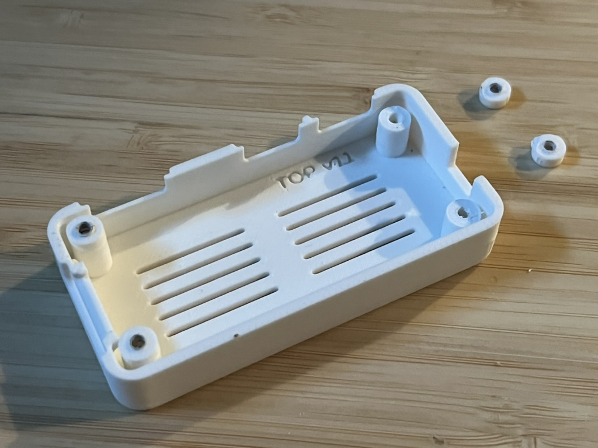

# Case retrospective

A record of how the printed case got from nothing to TOP v12 / BASE v9,
what went wrong along the way, and what we now do differently because of
it. It covers PIZERO-94 through PIZERO-124, 2026-09-11 to 2026-09-25.

The design itself is documented in [README.md](README.md). This file is
about the process and the failures, so the same mistakes are not made twice.

## Where it stands

| Part | Version | State |
|---|---|---|
| `base.stl` | BASE v9 | Confirmed on hardware. Unchanged since PIZERO-103 rev 2. |
| `top.stl` | TOP v12 | Rendered, not yet printed (PIZERO-124 boss webs). |
| `top_header.stl` | TOP-HDR v4 | Draft, never printed (PIZERO-102). |

69.8 x 34.8 x 18.6 mm, four M2.5 x 12 countersunk screws, no supports.
34 commits touch `hardware/case/` so far.

## Timeline

| Date | Issue | What happened |
|---|---|---|
| 09-11 | PIZERO-94 | First design. Base printed and fitted first time. The first lid fouled on assembly; blamed on the header, it was the microSD card. Fourteen revisions in one day, ending with the CoCo 2 roof vents. |
| 09-12 | PIZERO-95 | Case documented and linked from the project README and `docs/kit.md`. |
| 09-12 | PIZERO-96, 97 | Filed from 94: countersink angle is wrong; `[?]` dimensions never measured. Both still open. |
| 09-14 to 16 | PIZERO-101 | Style pass in eight revisions: floor vents, 5 mm corners, rounded ports, groove loop. The 5 mm rounded top edge printed badly and was reverted. |
| 09-15 | PIZERO-102 | Draft lid with an opening over the 40-pin header. Not printed. |
| 09-15 to 16 | PIZERO-103 | microSD slot re-derived from the socket datasheet. Card now goes in and stays in. Finger relief added. |
| 09-16 | PIZERO-105 | Version string engraved inside each part. |
| 09-17 | | Photos of the printed v9 case committed. |
| 09-18 | PIZERO-122 | Lid 2 mm lower: the header measures 8.34 mm, not the quoted 11.5. |
| 09-25 | PIZERO-123 | All plug pockets and the microSD relief share one top edge. Took three attempts. |
| 09-25 | PIZERO-124 | Two lid screw bosses snapped off. Bosses webbed into the corners, pilot opened. |

## What worked

**Code, not drawings.** The case is one OpenSCAD file and the STLs are
rendered from it. Every change is a diff, every printed part maps to a
commit, and a change like "lower the lid 2 mm" is one number.

**Derived constraints.** Vent rows are computed from the RUN and BOOT
positions, slot ends from the boss positions, the shared pocket top from
the tallest pocket. When something moves, the dependent geometry follows
instead of silently going wrong. Render-time echoes report the margins.

**Splitting at the PCB top.** Every connector opening is a notch open at
the split line, so nothing bridges and neither part needs supports.

**Commit before printing.** Adopted after the first lid (afa4900). Combined
with the engraved version (PIZERO-105), any part in hand can be matched to
its source. This paid off directly: the snapped lid below reads TOP v11,
so we know exactly which geometry failed.

**Checking the mesh, not the intent.** Recent changes are verified by
measuring the rendered STL: bounding boxes, the height of a specific face,
volume deltas against a hand calculation, and whether an untouched part
re-renders to identical geometry. That is what makes "the base is
unchanged" a fact instead of a hope.

## What went wrong, and the lessons

### 1. The first lid obstruction was misdiagnosed (PIZERO-94)

The first lid would not close. It looked like the 40-pin header, so
`head_room` went from 12 to 13 mm. It was actually the microSD card, and
the extra millimetre bought nothing (afa4900 reverted it).

**Lesson:** find what is actually touching before changing a dimension.
A change that does not fix the symptom is a sign the diagnosis was wrong,
not that the change was too small.

### 2. Generic figures and drawings were trusted over measurement

- The header was assumed to stand about 11.5 mm proud, the usual figure
  for a 2.54 mm header. It measures 8.34 mm. The lid carried 2 mm of
  wasted height for a week (PIZERO-122).
- The Waveshare drawing put the microSD housing front at x 0.5. A latched
  card sat flush with the wall, which only works if the housing front is
  at x 1.5 (PIZERO-103 rev 2).
- The first microSD slot was 1.2 mm too far forward and 2.5 mm tall, so a
  card either caught on its edge or rode over the socket and fell inside
  the case (PIZERO-103).

**Lesson:** the `[W]` / `[M]` / `[?]` tags in the source exist for this.
A `[?]` value is a risk until it is measured, and PIZERO-97 still lists
several. Look up the actual part (the TF-110 datasheet settled the
microSD channel) instead of a typical figure.

### 3. Features were designed without the print orientation in mind

The lid prints roof-down. Two features failed because of it:

- A 2 mm recessed vent panel needed a 27 mm bridge with unconnected ends.
  Replaced by shallow grooves (8cfc79a).
- A 5 mm rounded top edge started as a shallow overhang right at the bed
  and printed badly. Reverted to a 1 mm chamfer (PIZERO-101 rev 7).

**Lesson:** judge every lid feature upside down. Anything that hangs from
the roof or overhangs near the bed has to be justified in that orientation.

### 4. The screw bosses were weak in the print direction (PIZERO-124)

*TOP v11, 2026-09-25. Two of the four bosses have lost their tips; the
two rings on the right are the pieces. Each broke cleanly along a layer.*

Each boss was a free-standing 6 mm column, 10 mm long, with a 2.1 mm
self-tapping pilot leaving about 1.95 mm of wall. It stood only 0.9 mm
from both corner walls but was not joined to them. Printed roof-down,
every layer line runs straight across the boss, which is the weakest
direction for a column loaded from the side. The tight pilot also wedges
the wall outward as the screw cuts its thread.

This is lesson 3 again, on a structural part instead of a cosmetic one,
and it went unnoticed from the first lid to TOP v11, presumably because
the earlier lids were assembled gently.

**Fix (TOP v12):** a web fills each corner between the boss and its two
walls, from 1 mm above the PCB up to the roof, and the pilot opens to
2.2 mm. Not yet printed. If it is not enough, the next steps are a flared
root where the boss meets the roof, and printing with 4 or more walls.

**Lesson:** a vertical feature in a roof-down part is held together only
by layer adhesion. Tie it into a wall wherever there is one to tie into.

### 5. A simple request took three commits (PIZERO-123)

The ask was to make the microSD finger relief as tall as the plug pockets
so the openings match. The agent got it wrong twice before it was right:

1. **0f8f50c** made the relief 7.6 mm tall, centred on the card. That
   changed the base and left the tops at different heights, which was the
   whole point of the change.
2. **c7684c6** kept the base and lined the relief up with the HDMI pocket,
   but the USB-C pockets finish 0.15 mm higher, so the openings still did
   not all line up.
3. **38560ff** gave every pocket and the relief one shared top edge.

The underlying problem was that "7.6 mm tall", "tops lined up" and "base
unchanged" cannot all be true at once, and the agent resolved that
silently, twice, the wrong way.

**Lesson:** before changing geometry, say which edges move, which stay
fixed, and which parts get reprinted. When the constraints conflict, say
so and ask, rather than picking one.

### 6. Known defects are left waiting for a reprint

PIZERO-96 (the countersink is a 72.5 degree cone, not 90) was found on
day two and deliberately not fixed, because it would change a base that
was confirmed on hardware. The base has not changed since, so it is still
open. That was reasonable at the time, but it means a known defect ships
in every base.

**Lesson:** hold small base fixes for the next base reprint, but track
them together so the reprint picks them all up.

## Still open

| Issue | What |
|---|---|
| PIZERO-124 | Print TOP v12 and confirm the bosses survive repeated assembly. |
| PIZERO-123 | Print and confirm the pocket tops line up and the card is easier to grip. |
| PIZERO-103 | Confirm on hardware that a card ejects reliably from the rev 2 relief. |
| PIZERO-104 | Paperclip access to RUN and BOOT through the 1 mm slots is untested. |
| PIZERO-105 | The photo above shows TOP v11 legible; needs the user's confirmation to close. |
| PIZERO-102 | Header lid is a draft; opening size not agreed. |
| PIZERO-96 | Countersink angle; fold into the next base reprint. |
| PIZERO-97 | `[?]` dimensions still unmeasured. |

## Working rules this produced

- Commit the STL before sending it to the printer.
- Bump the engraved version for any part whose geometry changes, and only
  that part.
- Check every lid feature in print orientation, structural ones included.
- Measure before trusting a drawing or a typical figure, and re-tag the
  parameter `[M]`.
- Verify changes on the rendered mesh, including that untouched parts are
  still identical.
- Restate the geometric constraints of a change before making it, and ask
  when they conflict.
